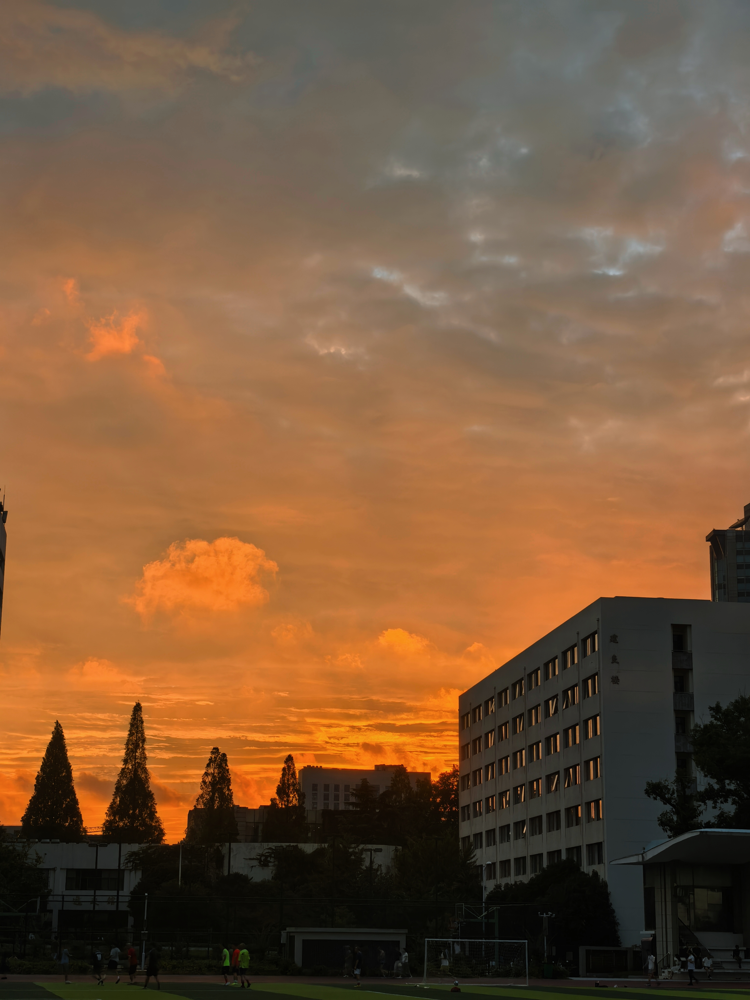

去年的这个时候，我应该是在操场散步；
于是我想我有理由在今天也来一次操场。

像是快要下雨了，今天空气格外清爽，蝉鸣声也格外响亮。

操场的云一直很好看，但可惜今天一般，像是一张残次又慵懒的灰色毯子。

我在去年的年终总结里说，我喜欢散步，因为“白天有云有树，晚上有人，有各种各样的人，看着形形色色的人心情就好了，那有什么理由不喜欢散步。”
现在想来，原来我脚板底下的每一寸土地亘古便恣意呼吸着，只是我用我自己的故事填充了这片土地的每条纹路，让回忆在她的血脉中温柔地流淌；于是当我的爱恨嗔痴指引着我踏上这片土地时，她便毫无保留地托举起我。
她告诉我，故事不需要凝结成真理，我更不需要从故事中汲取很多很多的教训；
她告诉我，去体验，去感受，去用力地呼吸——因为空气是有气味的。

故事编织出空气的气味，
而只有我再次在特定的时刻站在这片土地上时，彼时彼刻就向此时此刻热烈而温柔地奔涌而来，让往事的风和我打了个照面，又向着下一个和我约定的时分奔赴而去，假装那又是一次不期而遇。

风从背后吹来，我回头，一大片的晚霞倏然把我镶上俏皮的金边；我这才明白，我一直看着操场的那一边，看着那边有没有我期待的云朵，所以从来看不到晚霞。其实，晚霞不晚，微风正好。

去年的动态里，我似乎因未来的迷茫和无措陷入了现在看来莫名其妙的怪圈；其实最近几日，看着学弟学妹们搬着东西入住，三两好友结伴游览着校园，时间也好多好多次把我拽回分别看似遥遥无期的那段时光，于是会恍惚好一会。

去年，我用青峰的《我们都拥有海洋》作结，因为海是澎湃的，是流动的；这次我想用大同的《才二十三》作结:

“青春  是一个梦，
人生  如一阵春风，
不经意的飘过，
境界蓦然辽阔，

昨天变成了今天，
过去变成了现在，
未来刚才来，
它从何而来。”