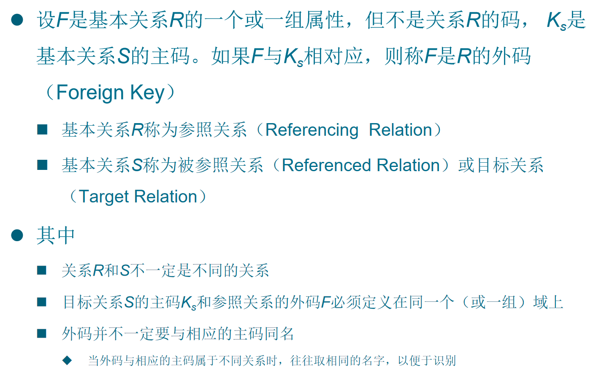
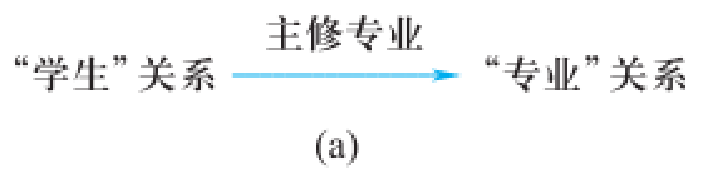
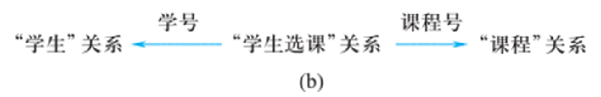
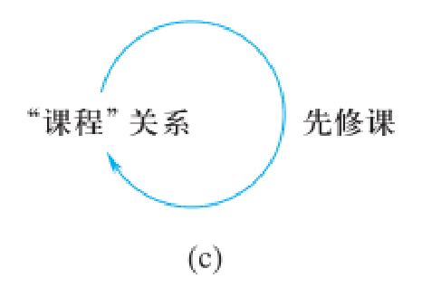

## 一、关系数据结构

### 1. 关系的基本概念

#### （1）域（Domain）

- **定义**：一组具有相同数据类型的值的集合。
- **示例**：
  - 整数集合
  - 性别集合：{‘男’, ‘女’}
  - 长度小于25的字符串集合

#### （2）笛卡尔积（Cartesian Product）

- **定义**：给定一组域 $$D_1, D_2, \ldots, D_n$$，其笛卡尔积为：
  $$
  D_1 \times D_2 \times \ldots \times D_n = \{(d_1, d_2, \ldots, d_n) \mid d_i \in D_i\}
  $$

- **元组**：笛卡尔积中的每个元素称为一个**n元组**。

- **分量**：元组中的每个值 $$d_i$$ 称为一个分量。

#### （3）关系（Relation）

- **定义**：笛卡尔积的**有意义的子集**。
- **属性**：每列有一个名称，称为属性。
- **目/度**：关系中属性的个数。
- **元组**：关系中的每一行。

> **示例**：三目关系：导师-研究生关系SMP(SUPERVISOR, MAJOR, POSTGRADUATE)

### 2. 关系的性质

1. **列同质**：每一列的分量来自同一域。
2. **属性名唯一**：不同属性可来自同一域，但名称必须不同。
3. **列顺序无关**：列可任意交换。
4. **元组唯一**：任意两个元组不能完全相同。
5. **行顺序无关**：行可任意交换。
6. **分量原子性**：每个分量必须是不可分的数据项。

### 3. 关系模式（Relation Schema）

**关系是关系模式在某一时刻的状态或内容，关系模式是型，关系是值**

- **定义**：对关系的描述，形式化为：
  $$
  R(U, D, DOM, F)
  $$

  - $$R$$：关系名
  - $$U$$：属性集合
  - $$D$$：属性所来自的域
  - $$DOM$$：属性到域的映射
  - $$F$$：属性间的依赖关系

- **简记**：$$R(A_1, A_2, \ldots, A_n)$$

### 4. 关系数据库

- **型**：关系模式的集合（数据库结构）
- **值**：某一时刻各关系对应的元组集合（数据库实例）


> 候选码（Candidate key）
>
> 关系模式中的某一个属性或一组属性的值能唯一地标识一个元组，而它的真子集不能，则称该属性或属性组为候选码
>
> 简单的情况：候选码只包含一个属性
>
> 最极端的情况：关系模式的所有属性组是这个关系模式的候选码，称为全码（All-key）
>
> ### 主码
>
> 若一个关系有多个候选码，则选定其中一个为主码（Primary key）
>
> ### 主属性
>
> 候选码的诸属性称为主属性（Prime attribute）
>
> 不包含在任何侯选码中的属性称为非主属性（Non-Prime attribute）或非码属性（Non-key attribute） 
{: .prompt-tip }

---

## 二、关系的完整性约束

### 1. 实体完整性（Entity Integrity）

- **规则**：主属性不能取空值。
- **示例**：选课关系SC(学号, 课程号, 成绩)中，学号和课程号都不能为空。

### 2. 参照完整性（Referential Integrity）

- **外码**：关系R中的属性组F是另一关系S的主码，则F是R的外码。
- **规则**：外码的值必须为空或等于被参照关系中某个主码值。
- **示例**：
  - 学生表中的“主修专业”必须是专业表中存在的专业名。
  - 课程表中的“先修课”必须是本表中已存在的课程号。


> ### 一、什么是参照完整性？
>
> **参照完整性**，简单来说，就是**确保一张表中的数据引用在另一张表中是存在的**。
>
> 它定义了表与表之间的一种“主从”或“父子”关系，要求**子表**中某个字段（或字段组）的值，必须在**父表**的主键字段中存在。
>
> **一个经典的比喻：**
> 想象一下公司和员工的关系。
>
> *   **父表 (公司表)**：`Companies(CompanyID, CompanyName)`
> *   **子表 (员工表)**：`Employees(EmployeeID, Name, CompanyID)`
>
> 参照完整性要求：`Employees` 表中的每一个 `CompanyID` 值，都必须在 `Companies` 表的 `CompanyID` 列中存在。你不能让一个员工属于一个不存在的公司。
>
> ---
>
> ### 二、核心概念与术语
>
> 
>
> 要理解参照完整性，必须先掌握以下几个关键术语：
>
> | 术语                     | 中文                | 定义                                                         | 在上例中指            |
> | :----------------------- | :------------------ | :----------------------------------------------------------- | :-------------------- |
> | **Foreign Key**          | **外码**            | **子表**中的一个属性（或属性组），它引用了另一张表（父表）的主键。 | `Employees.CompanyID` |
> | **Referenced Relation**  | **被参照关系/父表** | 被其他表引用的表，其主键被外键所引用。                       | `Companies` 表        |
> | **Referencing Relation** | **参照关系/子表**   | 包含外键的表，它引用了另一张表。                             | `Employees` 表        |
> | **Primary Key**          | **主键**            | 父表中被外键所引用的唯一标识符。                             | `Companies.CompanyID` |
>
> **一句话总结：参照完整性约束，就是约束着子表中外码的取值，必须来自于父表的主键。**
>
> ---
>
> ### 三、参照完整性规则
>
> 这个约束具体是如何起作用的呢？它对外键的取值有明确的规定：
>
> 对于子表中的每一个外键值，**它必须满足以下两个条件之一**：
>
> 1.  取**空值**（例如 `NULL`）。
> 2.  取父表中**某个元组主键的值**。
>
> **规则详解：**
>
> #### 1. 取空值 (NULL)
>
> *   **含义**：表示“未知”或“暂未分配”。
> *   **示例**：一个新员工刚入职，尚未被分配到具体的部门，那么他的 `DepartmentID` 外键字段就可以为 `NULL`。
>
> #### 2. 取父表主键的有效值
>
> *   **含义**：这是最常见的情况。外键的值必须是父表中确实存在的一个主键值。
> *   **示例**：员工的 `CompanyID` 必须是 `Companies` 表中已有的一条记录的 `CompanyID`。
>
> #### ⚠️ 违反规则的示例：
>
> 如果试图在 `Employees` 表中插入一条记录，其 `CompanyID` 为 `999`，但 `Companies` 表中根本不存在 `CompanyID=999` 的公司，那么这个操作就会**违反参照完整性约束**，数据库管理系统（DBMS）会拒绝执行此操作，并报错。
 {: .prompt-info }


> “学生”关系的“主修专业”属性与“专业”关系的主码“专业名”相对应
>
> “主修专业”属性是学生关系的外码
>
> “专业”关系是被参照关系，“学生”关系为参照关系 
>
> 
>
> “学生选课”关系的“学号” 与“学生”关系的主码“学号”相对应
>
> “ 学生选课”关系的“课程号”与“课程”关系的主码“课程号”相对应
>
> “学号”和“课程号”是“学生选课”关系的外码
>
> “学生”关系和“课程”关系均为被参照关系
>
> “学生选课”关系为参照关系
>
> 
>
> “课程”关系中“先修课”属性与本身的主码“课程号”属性相对应
>
> “先修课”是外码
>
> “课程”关系既是参照关系也是被参照关系
>
> 
 {: .prompt-tip }

### 3. 用户定义的完整性

- **定义**：用户根据应用语义定义的约束。
- **示例**：
  - 成绩必须在0~100之间
  - 姓名不能为空

---

## 三、关系代数

### 1. 传统的集合运算

- **并**（Union）：$$R \cup S$$
- **差**（Difference）：$$R - S$$
- **交**（Intersection）：$$R \cap S$$
- **笛卡尔积**（Cartesian Product）：$$R \times S$$

### 2. 专门的关系运算

#### （1）选择（Selection）

- 符号：$$\sigma_F(R)$$
- 功能：从R中选取满足条件F的元组。
- 示例：$$\sigma_{Smajor='信息安全'}(Student)$$

#### （2）投影（Projection）

- 符号：$$\pi_A(R)$$
- 功能：从R中选择属性子集A，==并去重==。
- 示例：$$\pi_{Sname, Sdept}(Student)$$

#### （3）连接（Join）

> 笛卡尔积通常会产生大量**无意义**的元组。连接的本质就是从笛卡尔积中筛选出有意义的元组

- **θ连接**：$$R \bowtie_{A \theta B} S$$

```plain text
定义：从R和S的笛卡尔积中选取满足给定条件A θ B的元组。


A是关系R中的一个属性（或属性组）


B是关系S中的一个属性（或属性组）


θ是比较运算符，如：=, >, <, >=, <=, <>


过程：先做R × S，再做σ_{A θ B}(R × S)


```

- **等值连接**：θ为“=”
- **自然连接**：等值连接 + 去重属性


> 自然连接是一种特殊的等值连接，它自动化了这个过程，更为简洁。
>
> - **符号表示**： R*⋈* S (无需指定条件)
> - **定义**：在两个关系R和S中，**自动寻找所有同名的属性**，然后基于这些同名属性值相等进行等值连接，并**在结果中去掉重复的同名属性**。
> - **步骤**：
>   1. 计算 `R × S`
>   2. 选择所有满足`R.A1 = S.A1 AND R.A2 = S.A2 AND ...`的元组（A1, A2...是R和S的同名属性）
>   3. 去掉重复的属性列，只保留一份同名属性
>
> **举例说明：**
> `Students \bowtie Scores`
> 假设`Students`和`Scores`都有一个名为`Sno`的属性，DBMS会自动发现这一点。这个操作等价于：
> `π_{Students.Sno, Sname, Dept, Cno, Grade}(σ_{Students.Sno = Scores.Sno}(Students × Scores))`
> (先做笛卡尔积 -> 然后选择学号相等的行 -> 最后在投影中去除重复的Sno列)
 {: .prompt-tip }

#### （4）外连接（Outer Join）

- **左外连接**：保留左表所有元组
- **右外连接**：保留右表所有元组
- **全外连接**：保留两侧所有元组


> 自然连接和等值连接都有一个特点：只保留匹配成功的元组。**悬浮元组**（Dangling Tuple）是指在连接过程中因无法匹配而被丢弃的元组。
>
> **外连接**的目的就是**保留这些悬浮元组**，并用`NULL`值填充缺失的属性。
>
> #### 1. 左外连接
>
> *   **符号**： `R ⟕ S` 或 `LEFT OUTER JOIN`
> *   **功能**：保留**左边关系R**中的所有元组。如果R的某个元组在S中找不到匹配的，则结果中该元组对应S的所有属性置为NULL。
>
> #### 2. 右外连接
>
> *   **符号**： `R ⟖ S` 或 `RIGHT OUTER JOIN`
> *   **功能**：保留**右边关系S**中的所有元组。如果S的某个元组在R中找不到匹配的，则结果中该元组对应R的所有属性置为NULL。
>
> #### 3. 全外连接
>
> *   **符号**： `R ⟗ S` 或 `FULL OUTER JOIN`
> *   **功能**：同时保留左边关系R和右边关系S中的所有悬浮元组。它是左外连接和右外连接的并集。
>
> **外连接总结图示：**
> 假设关系R和S进行连接，下图清晰地展示了不同连接类型的结果范围：
>
> ```
>           R                  S
>     +------------+     +------------+
>     | (匹配部分) |     | (匹配部分) |
>     +------------+     +------------+
>           ｜                ｜
>           ｜                ｜
>       +----------------------------+
>       |        自然连接/内连接       |
>       +----------------------------+
>         ／                         ＼
>         ／                           ＼
> +-----------------+             +-----------------+
> |   R的悬浮元组   |             |   S的悬浮元组   |
> | (左外连接保留)  |             | (右外连接保留)  |
> +-----------------+             +-----------------+
>         ＼                         ／
>          ＼                       ／
>       +----------------------------+
>       |       全外连接(全部保留)     |
>       +----------------------------+
> ```
 {: .prompt-tip }

#### （5）除运算（Division）

- 符号：$$R \div S$$

- 功能：找出满足“包含所有S中元组”的R元组。

- 示例：查询选修了所有课程的学生：
  $$
  \pi_{Sno, Cno}(SC) \div \pi_{Cno}(Course)
  $$


> ### 一、为什么需要除运算？
>
> 除运算是为了回答这样一种查询：**“查询选择了所有某某项目的学生”** 或 **“查询包含了所有某某零件的供应商”**。
>
> 这类问题的特点是：**“所有”** 或 **“包含”**。它寻找的是满足某种“完整性”或“包含性”条件的元组。用选择、投影、连接虽然也能实现，但会非常繁琐，而除运算则提供了一种直接的、集合层面的解决方案。
>
> ---
>
> ### 二、直观理解：除运算的比喻
>
> 我们可以用一个非常贴切的比喻来理解除运算：
>
> **“除法是乘法的逆运算”**
>
> 在关系代数中：
>
> *   **乘法** 对应 **笛卡尔积** `R × S`。
> *   **除法** 则可以理解为：给定一个结果（类似于乘积）和一个关系（类似于乘数），求另一个关系（类似于被乘数）。
>
> **更形象的比喻：食谱**
> 假设：
>
> *   关系 `R(厨师, 食材)`：记录了每个厨师会处理哪些食材。
> *   关系 `S(食材)`：是一份食谱所需的全部食材清单。
>
> 那么，除运算 `R ÷ S` 的结果就是：**能找到所有食谱所需食材的厨师**。即，**这位厨师的技能集合完全包含了这份食谱的要求**。
>
> ---
>
> ### 三、形式化定义
>
> 给定两个关系：
>
> *   `R(X, Y)`
> *   `S(Y, Z)`
>     *   其中 `X, Y, Z` 是属性组。
>     *   **注意**：`S` 中的属性组 `Y` 必须和 `R` 中的属性组 `Y` **出自相同的域**（数据类型一致），但**属性名可以不同**。
>
> 除运算的结果是一个新关系 `P(X)`，它包含的是 `R` 中满足以下条件的元组在 `X` 属性上的投影：
> **关系 `R` 中某个 `X` 分量值 `x` 对应的所有 `Y` 值的集合，必须包含关系 `S` 中所有 `Y` 值的集合。**
>
> 用公式表示为：
> $$ R \div S = \{ t_r[X] \ | \ t_r \in R \land \pi_Y(S) \subseteq Y_x \} $$
> 其中：
>
> *   $$ Y_x = \{ t[Y] \ | \ t \in R \land t[X] = x \} $$：称为 **`x` 在 `R` 中的象集**。它表示在关系 `R` 中，所有 `X` 值为 `x` 的元组所对应的 `Y` 值的集合。
> *   $$ \pi_Y(S) $$：是关系 `S` 在 `Y` 属性组上的投影，即 `S` 中所有 `Y` 值的集合（去重后）。
>
> **核心思想**：对于结果中的每一个 `x`，它的“伴侣”集合（象集 $$Y_x$$）必须能“配得上”或“覆盖” `S` 提供的整个“套餐” ($$ \pi_Y(S) $$)。
>
> ---
>
> ### 四、一步步计算：通过经典示例
>
> 我们通过一个经典例子来一步步拆解除运算的过程。这是理解除运算最关键的一步。
>
> **已知关系 R 和 S：**
>
> |  A   |  B   |  C   | (关系 R) |      |  B   |  C   | (关系 S) |
> | :--: | :--: | :--: | :------: | ---- | :--: | :--: | :------: |
> |  a1  |  b1  |  c2  |          |      |  b1  |  c2  |          |
> |  a1  |  b2  |  c3  |          |      |  b2  |  c1  |          |
> |  a1  |  b2  |  c1  |          |      |  b2  |  c3  |          |
> |  a2  |  b3  |  c7  |          |      |      |      |          |
> |  a2  |  b2  |  c3  |          |      |      |      |          |
> |  a3  |  b4  |  c6  |          |      |      |      |          |
> |  a4  |  b6  |  c6  |          |      |      |      |          |
>
> **求：** `R ÷ S`
>
> #### 第一步：分析属性
>
> *   `R` 的属性是 `(A, B, C)`。我们可以将其视为 `(X, Y)`，其中 `X = A`, `Y = (B, C)`。
> *   `S` 的属性是 `(B, C)`，这与 `R` 中的 `Y` 属性组对应。
>
> #### 第二步：计算 `S` 在 `Y` 属性组上的投影 `π_Y(S)`
>
> 这其实就是 `S` 的所有内容（因为 `S` 只有 `(B, C)` 属性）：
> $$ \pi_{(B,C)}(S) = \{ (b1, c2), (b2, c1), (b2, c3) \} $$
> **这个集合就是我们需要去匹配的“标准套餐”。**
>
> #### 第三步：计算 `R` 中每个 `X`（即每个 `A` 值）的象集 $$Y_x$$
>
> 我们需要找出 `R` 中每个不同的 `A` 值，都搭配了哪些 `(B, C)`。
>
> *   **对于 `a1`**：在 `R` 中，`A=a1` 的元组有 `(a1,b1,c2)`, `(a1,b2,c3)`, `(a1,b2,c1)`。
>     *   所以 `a1` 的象集 $$Y_{a1} = \{ (b1, c2), (b2, c3), (b2, c1) \}$$
> *   **对于 `a2`**：在 `R` 中，`A=a2` 的元组有 `(a2,b3,c7)`, `(a2,b2,c3)`。
>     *   所以 `a2` 的象集 $$Y_{a2} = \{ (b3, c7), (b2, c3) \}$$
> *   **对于 `a3`**：在 `R` 中，`A=a3` 的元组有 `(a3,b4,c6)`。
>     *   所以 `a3` 的象集 $$Y_{a3} = \{ (b4, c6) \}$$
> *   **对于 `a4`**：在 `R` 中，`A=a4` 的元组有 `(a4,b6,c6)`。
>     *   所以 `a4` 的象集 $$Y_{a4} = \{ (b6, c6) \}$$
>
> #### 第四步：将每个象集与“标准套餐” `π_Y(S)` 进行比较
>
> 看谁的象集**包含**了“标准套餐”。
>
> *   $$Y_{a1} = \{ (b1,c2), (b2,c3), (b2,c1) \}$$ **⊇** $$\{ (b1,c2), (b2,c1), (b2,c3) \}$$ ✅ **包含！**
> *   $$Y_{a2} = \{ (b3,c7), (b2,c3) \}$$ **⊉** $$\{ (b1,c2), (b2,c1), (b2,c3) \}$$ ❌ 缺少 (b1,c2) 和 (b2,c1)
> *   $$Y_{a3} = \{ (b4,c6) \}$$ **⊉** $$\{ (b1,c2), (b2,c1), (b2,c3) \}$$ ❌ 一个都不匹配
> *   $$Y_{a4} = \{ (b6,c6) \}$$ **⊉** $$\{ (b1,c2), (b2,c1), (b2,c3) \}$$ ❌ 一个都不匹配
>
> #### 第五步：得到结果
>
> 只有 `a1` 的象集完全包含了 `S` 的所有可能。因此，除运算的结果是：
> $$ R \div S = \{ a1 \} $$
>
> |  A   |
> | :--: |
> |  a1  |
>
> ---
>
> ### 五、实际数据库中的应用示例
>
> 以经典的`学生-课程-选课`数据库为例：
>
> *   `Student(Sno, Sname)` (学生)
> *   `Course(Cno, Cname)` (课程)
> *   `SC(Sno, Cno, Grade)` (选课)
>
> **查询：选修了全部课程的学生学号。**
>
> 1. **分析**：“全部课程”意味着我们要找一个学生，他的选课记录必须包含课程表中的每一门课。
>
> 2. **建模**：
>
>    *   关系 `R` 应包含 **学生** 和 **课程** 的信息。这正是 `SC` 表：`SC(Sno, Cno)`，我们可以将其视为 `R(X, Y)`，其中 `X=Sno`, `Y=Cno`。
>    *   关系 `S` 应提供 **“全部课程”** 的清单。这正是 `Course` 表的主码投影：`π_{Cno}(Course)`。我们可以将其视为 `S(Y)`。
>
> 3. **运算**：
>    $$
>    \pi_{Sno, Cno}(SC) \div \pi_{Cno}(Course)
>    $$
>    这个运算的结果就是一个包含所有满足条件的学生学号的集合。
>
> **如果要查询姓名，只需将结果与Student表连接即可：**
> $$
> (\pi_{Sno, Cno}(SC) \div \pi_{Cno}(Course)) \bowtie \pi_{Sno, Sname}(Student)
> $$
>
> ---
>
> ### 六、总结
>
> | 核心概念     | 解释                                                         |
> | :----------- | :----------------------------------------------------------- |
> | **目的**     | 解决“查询所有...”这类包含性查询。                            |
> | **输入**     | 两个关系 `R(X, Y)` 和 `S(Y, Z)`。                            |
> | **输出**     | 一个关系 `P(X)`。                                            |
> | **核心机制** | 计算 `R` 中每个 `X` 值对应的 `Y` 的象集，判断该象集是否**包含** `S` 中所有 `Y` 值的集合。 |
> | **关键步骤** | 1. 求 \( \pi_Y(S) \) <br> 2. 求每个 `x` 的象集 \( Y_x \) <br> 3. 比较 \( Y_x \supseteq \pi_Y(S) \) ? |
> | **SQL实现**  | 没有直接的DIVIDE运算符，通常用`NOT EXISTS`双重嵌套子查询实现。 |
>
> 只要牢记 **“象集包含”** 这个核心概念，并通过例子熟练象集的求法和比较，你就能彻底掌握除运算。它是关系代数完备性的体现，虽然抽象，但逻辑非常严密和强大。
 {: .prompt-tip }


## 四、综合示例

### 示例1：查询选修了81001和81003课程的学生

```sql
K = { (81001), (81003) }

π_{Sno, Cno}(SC) ÷ K
```

### 示例2：查询选修了81002课程的学生

```sql
π_{Sno}(σ_{Cno='81002'}(SC))
```

### 示例3：查询选修了直接先修课为81003的课程的学生姓名

```sql
π_{Sname}(σ_{Cpno='81003'}(Course) ⋈ SC ⋈ π_{Sno, Sname}(Student))
```

### 示例4：查询选修了所有课程的学生

```sql
π_{Sno, Cno}(SC) ÷ π_{Cno}(Course) ⋈ π_{Sno, Sname}(Student)
```

---

## 五、总结

| 概念       | 说明                               |
| ---------- | ---------------------------------- |
| 关系       | 二维表，元组的集合                 |
| 关系模式   | 关系的结构描述                     |
| 完整性约束 | 实体、参照、用户定义               |
| 关系代数   | 查询语言基础：选择、投影、连接、除 |

