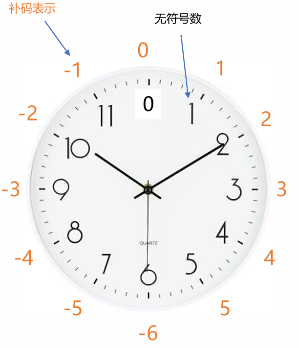
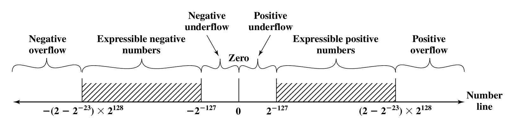
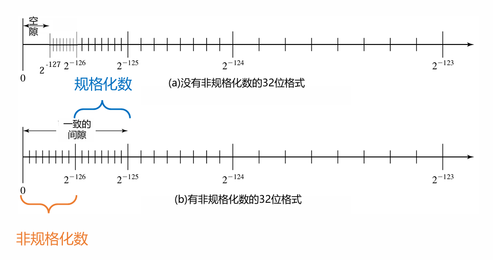

# 数据的机器级表示及校验

## 整数的二进制数表示

> 二进制中，1表示正数，0表示负数，行不行？
>
> {: .prompt-info }

### **原码表示**

#### 原码表示法的核心规则：

1.  用最高位表示符号：`0` 表示正数，`1` 表示负数。
2.  其余位表示该数的绝对值。
3.  因此，零有两种表示形式：`+0` (`000...0`) 和 `-0` (`100...0`)。

我们以 **4位二进制** 为例来说明。4位原码能表示的范围是：-7 到 +7。

---

#### 4位原码表示的数轴图

下图直观地展示了原码在数轴上的分布。**请注意零的两种表示形式**，这是原码最显著的特点。

```plaintext
数值:    -7    -6   -5   -4   -3   -2   -1   -0   +0   +1   +2   +3   +4   +5   +6   +7
二进制:  1111 1110 1101 1100 1011 1010 1001 1000 0000 0001 0010 0011 0100 0101 0110 0111
         ◄─── 负数区域（符号位为1）                     正数区域（符号位为0） ───►        
         
数轴:
◄───┼───┼───┼───┼───┼───┼───┼───┼───┼───┼───┼───┼───┼───┼───┼───┼───▶
   -7  -6  -5  -4  -3  -2  -1   -0/+0   +1  +2  +3  +4  +5  +6  +7
```

---

#### 图解分析：

1.  **对称性**：
    *   数轴以 **0** 为中心，几乎完全对称（除了0本身）。
    *   每一个正数（除+0）都有一个对应的负数。例如，`+3` (`0011`) 和 `-3` (`1011`)，它们的区别仅在于最高位的符号位。

2.  **零的表示**：
    *   这是原码表示法的“瑕疵”。`0000` 被定义为 `+0`，`1000` 被定义为 `-0`。
    *   在数轴上，它们占据同一个点，但却有两个不同的二进制编码。这会导致计算和比较时需要额外的逻辑来判断。

3.  **绝对值与编码**：
    *   将一个数的原码表示**去掉符号位**，剩下的部分就是其**绝对值**的二进制形式。
    *   例如：
        *   `+5` -> `0` `101` -> 绝对值是 `101` (5)
        *   `-5` -> `1` `101` -> 绝对值也是 `101` (5)

#### 原码的优缺点从数轴可见：

*   **优点**：非常**直观**。人类很容易理解其表示方式，从二进制码直接就能看出数值的大小和正负。
*   **缺点**：
    *   **运算复杂**：从数轴上看，计算 `2 + (-3)` 需要经过以下步骤：
        1.  判断符号不同。
        2.  比较绝对值 |2| 和 |-3| (即3) 谁大。
        3.  用大的绝对值减去小的绝对值：3 - 2 = 1。
        4.  结果符号与绝对值大的数相同，即负号。
        5.  最终结果为 `-1`。
            这个过程无法用简单的加法器电路完成，**硬件实现效率低**。
    *   **存在两个零**：浪费了一个编码空间，并带来歧义。

这个数轴清晰地表明了为什么原码虽然易于理解，但却不是计算机存储有符号数的理想方案。**补码**通过重新映射负数的位置，完美解决了上述问题。


### 补码表示

#### 4位补码表示的数轴图



补码的数轴不再是像原码那样对称的，而是一个**模循环**。下图展示了这种独特的结构：

```plaintext
数值:    -1    -2    -3    -4    -5    -6    -7    -8     +0   +1   +2   +3   +4   +5   +6   +7
二进制:  1111  1110  1101  1100  1011  1010  1001  1000   0000 0001 0010 0011 0100 0101 0110 0111
         ◄─── 负数区域（高位为1）                      正数区域（高位为0） ───►
         
数轴 (线性逻辑，更直观):
◄───┼─────┼─────┼─────┼─────┼─────┼─────┼─────┼─────┼─────┼─────┼─────┼─────┼─────┼─────┼─────▶
   -8    -7    -6    -5    -4    -3    -2    -1     0    +1    +2    +3    +4    +5    +6   +7
(1000) (1001)(1010)(1011)(1100)(1101)(1110)(1111)(0000)(0001)(0010)(0011)(0100)(0101)(0110)(0111)
```

---

#### 图解分析：

1.  **唯一的零**：
    *   补码中，**零只有一种表示形式：`0000`**。这是补码相对于原码的第一个巨大优势。

2.  **负数的重新映射**：
    *   这是补码最精妙的设计。**负数被“放置”在了正数区域的上方**。
    *   注意看数轴，`-1` 的编码是 `1111`，`-2` 是 `1110`，……，一直到 `-8` 是 `1000`。
    *   如果我们把这些负数的补码**当作无符号整数**来解释，它们的值分别是 15, 14, 13, ... , 8。
    *   你会发现一个关键规律：**一个负数的补码，其无符号值 = 模数 (16) + 该负数的真值**。
        *   例如：`-5` 的补码是 `1011`。将其视为无符号数，值是 11。而 `16 + (-5) = 11`。完美吻合！

3.  **模运算与循环数轴**：
    *   4位系统的模是 2^4 = 16。补码的数轴是一个首尾相接的**圆（模16循环）**。
    *   **加法是顺时针移动**，**减法是逆时针移动**。
    *   计算 `7 - 2` 可以理解为 `7 + (-2)`。
        *   `7` 的位置是 `0111`。
        *   `-2` 的补码是 `1110`（从图上看，它位于 `7` 的“上方”，其无符号值是14）。
        *   将两者相加：`0111 (7) + 1110 (14) = 1 0101`。
        *   由于只有4位，最高位的1**溢出被丢弃**，剩下 `0101`，也就是 `5`。结果正确！
    *   这个“溢出”在模运算中是合理的，因为 `7 + 14 = 21`，而 `21 mod 16 = 5`。

4.  **“取反加一”的几何解释**：
    *   求一个数 `X`（例如 `5`, `0101`) 的相反数 `-X`，就是在数轴上找到一个数 `Y`，使得 `X + Y = 0 (mod 16)`。
    *   如何找到这个 `Y`？从 `X` 出发，需要走多远才能绕一圈回到0？
    *   路径长度 = 模数 (16) - X。
    *   “取反加一”就是这个路径的快捷方式：
        *   **取反**：`0101` -> `1010` (值是10)。这相当于 `(15 - 5) = 10`。
        *   **加一**：`10 + 1 = 11`。而 `16 - 5` 正好等于 `11`。
    *   所以，`1011` (11) 就是我们要找的 `-5` 的补码。

#### 补码的核心优势从数轴可见：

*   **统一了加减法**：CPU不需要知道数是正还是负，也不需要减法器。**只需要一个加法器，就可以完成所有加减运算**。计算 `A - B` 时，CPU只需要计算 `A + (B的补码)`，然后丢弃溢出位即可。这是硬件设计上的巨大简化。
*   **消除了“-0”**：`0000` 唯一表示0。`1000` 这个编码被赋予了新的含义：**-8**。这也解释了为什么补码的负数范围比正数多一个（-8 ～ -1, 0, +1 ～ +7）。

#### 总结对比：

| 特性           | 原码 (Sign-Magnitude)        | 补码 (Two's Complement)    |
| :------------- | :--------------------------- | :------------------------- |
| **零的表示**   | 两种 (`+0`, `-0`)            | **一种** (`0`)             |
| **加减法操作** | 需要复杂逻辑，判断符号和大小 | **一个加法器通吃所有情况** |
| **数轴结构**   | 对称（除0外）                | **模循环**                 |
| **硬件需求**   | 复杂                         | **极其简单**               |
| **直观性**     | **非常直观**                 | 不直观，需要理解模概念     |

正是因为补码在**硬件实现上的巨大优势**，它成为了现代计算机表示有符号整数的绝对标准。它的设计是计算机工程学中“**用软件的复杂性（理解概念）换取硬件的极简性**”的经典范例。

> ## 取反加一
>
> ### 1. “取反”：求的是 `(2^k - 1) - x`
>
> 对于一个 `k` 位（包括符号位）的二进制数 `x`（这里 `x` 是正数的原码）：
>
> *   `2^k - 1` 是一个 `k` 位全为 `1` 的二进制数。例如，4位系统中，`2^4 - 1 = 15`，即 `1111`。
> *   对 `x` 的每一位进行取反（`0`变`1`, `1`变`0`），得到的结果我们称为 `~x`（按位取反）。
>
> **这个取反操作 `~x` 的数学本质是什么？**
> 它就是 `(2^k - 1)` 这个最大值减去 `x` 的值。
> `~x = (2^k - 1) - x`
>
> **例子（4位系统，求 -5 的补码）：**
>
> *   `x = 5` 的原码： `0101`
> *   `2^4 - 1 = 15` (二进制 `1111`)
> *   **取反操作 (`~x`)**： `0101` -> `1010`
> *   **数学验证**： `15 (1111) - 5 (0101) = 10 (1010)`。结果 `1010` 正是取反的结果。
>
> 所以，**“取反”这一步完成了绝大部分工作，它得到了 `(2^k - 1) - x`**。
>
> ### 2. “加一”：是为了得到最终的 `2^k - x`
>
> 我们已经通过“取反”得到了 `(2^k - 1) - x`。
> 而我们的最终目标是得到 `x` 的补码，即 `-x` 的机器数表示，其数学定义是 `2^k - x`（在模 `2^k` 的系统下）。
>
> 让我们比较一下目标和当前结果：
>
> *   **目标**： `2^k - x`
> *   **当前结果**： `(2^k - 1) - x`
>
> 很容易发现，目标和当前结果之间正好相差 `1`：
> `(2^k - x) - [(2^k - 1) - x] = 1`
>
> **因此，“加一”就是为了弥补这个 `1` 的差距！**
> `(2^k - 1) - x + 1 = 2^k - x`
>
> **继续上面的例子：**
>
> *   取反后的结果： `1010` (值是 10)
> *   **加一操作**： `1010 + 1 = 1011`
> *   **数学验证**： `16 (10000) - 5 (0101) = 11 (1011)`。结果 `1011` 正是 `-5` 的补码。
>
> {: .prompt-tip }

#### 补码的真值

对于一个 **n 位**的补码机器数：  
**\( X = -x_{n-1} \times 2^{n-1} + \sum_{i=0}^{n-2} x_i \times 2^i \)**

> *   \( x_{n-1} \)：**最高位（符号位）**。
>     *   若为 `1`，则 \( -x_{n-1} \times 2^{n-1} = -1 \times 2^{n-1} \)，提供一个巨大的负权重（例如 n=8 时，是 -128）。
>     *   若为 `0`，则该项为 `0`，不影响结果。
>
> *   \( \sum_{i=0}^{n-2} x_i \times 2^i \)：**剩余数值位**按无符号二进制数解析的值。
>
> {: .prompt-tip }


## 浮点数的二进制数表示

> 浮点数的二进制表示是一种精巧的权衡艺术，它通过**符号位、阶码（带偏移）和尾数（规格化隐含前导1）** 的三段式结构，用有限的二进制位实现了对广大实数范围的近似表示。**IEEE 754标准**统一了这种表示方法，并通过**非规格化数**和**特殊值**等设计，增强了数值计算的健壮性。**舍入**规则则确保了近似过程的精确性和可预测性。

### 浮点数二进制表示的核心思想

浮点数用于表示实数，其核心思想是采用**科学计数法**的二进制版本，以在有限的位数内同时表示极大、极小的数以及高精度的数。通用格式为：
**\[ \pm S \times B^E \]**

-   **±**：符号位（Sign）
-   **S**：尾数/有效数（Significand/Mantissa）
-   **B**：基数/底（Base），通常为2（二进制下隐含，不存储）
-   **E**：阶码/指数（Exponent）

---

### 1. 规格化数 (Normalized Numbers)



为了消除同一数值的多种表示形式（如 `0.110 × 2⁵` 和 `110 × 2²`），浮点数采用**规格化**表示。

-   **规格化形式**：`± 1.bb...b × 2^E`
    -   尾数的最高位总是**1**（即整数部分为1）。
    -   这个**前导1是隐含的**，不需要在存储的尾数字段中表示，从而节省一位，提高精度。
-   **阶码的存储**：阶码 `E` 的真实值需要加上一个**偏移量（Bias）** 再存入阶码字段。这使其总为正数，便于无符号比较。
    -   例如，8位阶码的偏移量是127，真实值 `E = 0` 则存储为 `127`；`E = -1` 存储为 `126`。

---

### 2. 表示范围与精度权衡

对于固定长度的浮点数格式（如32位单精度），其表示范围和精度之间存在权衡：

- **增加阶码位数**：➡️ **扩大表示范围**，⬇️ 降低精度（尾数位数减少）。

- **增加尾数位数**：➡️ **提高表示精度**，⬇️ 缩小范围（阶码位数减少）。

- **采用更大的基数B**：可以实现更大的范围，但可能会提高或降低精度。

  > **采用更大基数（B）对浮点数的影响总结**：
  >
  > 1. **表示范围扩大**  
  >    基数B越大，阶码权重越高（\(B^E\)），相同阶码位数下可表示范围显著扩大。
  > 2. **精度变化取决于数值大小**：
  >    - **小数值（E为负）**：精度提高  
  >      相邻可表示数间隔更小（如B=16时，\(16^E\)衰减更快，间隔\(\Delta v = B^{E-S+1}\)更小）
  >    - **大数值（E为正）**：精度降低  
  >      相邻可表示数间隔更大（如B=16时，\(16^E\)增长更快，间隔更大）
  >
  > {: .prompt-info }

---

### 3. 非规格化数 (Denormalized Numbers)



用于解决**下溢（Underflow）** 问题，即数值太小，无法用规格化形式表示（指数已达到最小值）。

-   **作用**：填补0与最小规格化数之间的“空隙”，实现**渐进下溢**。
-   **形式**：当阶码字段为全0时，尾数的隐含位变为**0**（而非1），即表示为 `± 0.bb...b × 2^(E_min)`。
-   **优点**：避免了因计算结果小于最小规格化数而被直接舍入为0的情况，保留了更多的数值信息。

> 即使在“可表示范围（Expressible Numbers）”内，也绝不是所有实数都能被精确表示的。浮点数只能表示这个范围内的**有限个**离散的数值点。
>
> 下图非常清晰地展示了这一点：数轴上的黑点代表可精确表示的浮点数，点与点之间存在着无法精确表示的“空隙”（Gaps）。
>
> ```plaintext
> Negative overflow
> ◄───┼─────┼─────┼─────┼─────┼─────┼─────┼─────┼─────┼─────┼─────┼─────┼───►
>  │     │     │     │     │     │     │     │     │     │     │     │
>  ▼     ▼     ▼     ▼     ▼     ▼     ▼     ▼     ▼     ▼     ▼     ▼
> Expressible negative numbers      Zero     Expressible positive numbers
> (离散的点，之间有间隙)                 (一个点)    (离散的点，之间有间隙)
> ```
>
> ---
>
> ### 那么，什么时候会用到非规格化数呢？
>
> 非规格化数解决的并不是“所有数都能精确表示”的问题（这是不可能的），而是解决“**在0附近如何表示**”的问题。
>
> 我们可以把“可表示范围”分成三个连续的区间来看：
>
> 1.  **规格化数区间 (Normalized Numbers)**
>     *   **范围**：从 `[±2^{-126})` 到 `[±(2-2^{-23})×2^{128}]`（对于单精度）。
>     *   **特点**：这个区间的数用规格化形式表示（隐含前导1）。数值越大，点与点之间的间隔（即精度）也越大。
>     *   **问题**：这个区间**无法表示0和比 `2^{-126}` 更小的数**，这就留下了“下溢空隙”。
>
> 2.  **非规格化数区间 (Denormalized/Subnormal Numbers)**
>     *   **范围**：从 `±2^{-149}`（单精度最小值）到 just under `±2^{-126}`。
>     *   **作用**：**专门用来填补“规格化数区间”和“0”之间的那个巨大空隙**。它通过牺牲精度（尾数没有隐含前导1，有效位数变少）来换取范围的扩展，使得表示能力能够“平滑地”、“渐进地”下降到0，而不是突然跌落到0。
>     *   **所以，非规格化数本身就是“可表示范围”的一部分**，是表示极小数的手段。
>
> 3.  **零点 (Zero)**
>     *   这是一个特殊的、唯一能精确表示的点。
>
> ---
>
> ### 核心结论与类比
>
> | 情况               | 数学结果                 | 浮点表示                         | 解释                                                         |
> | :----------------- | :----------------------- | :------------------------------- | :----------------------------------------------------------- |
> | **落在黑点上**     | e.g., `0.5`, `2.0`       | **精确表示**                     | 这个数正好是一个可表示的浮点数。                             |
> | **落在黑点之间**   | e.g., `0.1`, `3.1415926` | **舍入**                         | 这个数无法精确表示，会被舍入到最近的那个黑点（可表示的浮点数）。**这是最常见的情况。** |
> | **落在“下溢空隙”** | e.g., `1.0e-40`          | **非规格化数 或  flush to zero** | 如果没有非规格化数，它会被舍入为0。**非规格化数的存在，就是把这个“空隙”也填满了黑点**，使得这些极小数也能被表示（尽管精度很低）。 |
> | **超出数轴范围**   | e.g., `1.0e40`           | **溢出 (Overflow)**              | 结果太大（或太小），超出了可表示范围，会被表示为无穷大（Infinity）。 |
>
> **一个简单的类比：**
> 想象一把分辨率有限的尺子。
>
> *   **规格化数**：就像尺子上从1厘米开始的标准刻度，间隔均匀但越来越大。
> *   **非规格化数**：就像在尺子的0厘米到1厘米之间，手工添加的一系列**不均匀的、更密集的微小刻度**。没有它们，0到1厘米之间的任何测量值都只能被记录为“0”。有了它们，我们虽然量得不准，但至少知道它比0大，是一个非零值。
> *   **舍入**：就像你用这把尺子去测量一个长度，读数和真实长度之间总有误差，你只能读到最接近的那个刻度值。
>
> 所以，**非规格化数并不是用来让所有数都能被精确表示的，而是专门为了在0附近提供一种表示能力，避免极小的非零值被直接当作0处理，从而保证数值计算在0附近的健壮性和连续性。**
>
> {: .prompt-info }


### 4. IEEE 754 标准

该标准是浮点数表示的工业规范，定义了两种基本格式：

| 参数         | 单精度 (32位)             | 双精度 (64位)             |
| :----------- | :------------------------ | :------------------------ |
| **总位数**   | 32                        | 64                        |
| **符号位**   | 1位                       | 1位                       |
| **阶码位宽** | 8位                       | 11位                      |
| **阶码偏移** | +127                      | +1023                     |
| **尾数位宽** | 23位（存储23位，隐含1位） | 52位（存储52位，隐含1位） |

#### 特殊值表示：

IEEE 754 还规定了一系列特殊值的位模式，用于处理异常情况：

-   **±0**：阶码和尾数全为0，符号位区分正负零。
-   **±∞**：阶码全为1，尾数全为0。
-   **NaN (非数)**：阶码全为1，尾数**非0**。用于表示无效操作的结果（如 `0/0`, `√(-1)`）。
    -   **静默NaN (qNaN)**：不触发异常的NaN，用于传播。
    -   **通知NaN (sNaN)**：用于触发异常的NaN。


> ## 机器如何区分规格化数和非规格化数
>
> ### 核心原理：通过指数字段的特模式来区分
>
> 机器并不需要为每个数额外存储一个标志位来说明“我是规格化数”或“我是非规格化数”。它通过**解读指数域（Exponent Field）的二进制模式**来自动完成这种区分。
>
> 我们以最普遍的**单精度（32位）浮点数**为例，它的结构是：`[1位符号位 S][8位指数位 E][23位尾数位 F]`。
>
> 机器遵循以下规则来解码：
>
> 1.  **如果指数位 `E` 不全为0且不全为1** (`0 < E < 255`)
>     *   **这是一个规格化数（Normalized Number）**。
>     *   **实际指数** = `E - 偏置（Bias）`。对于单精度，偏置是127，所以实际指数范围是 `-126` 到 `+127`。
>     *   **实际尾数** = `1.F`。即在23位尾数 `F` 之前隐含着一个**前导的1**。这就是“规格化”的含义，通过调整指数，使得数字总是以 `1.xxx...` 的形式表示。
>
> 2.  **如果指数位 `E` 全为1** (`E == 255`)
>     *   如果尾数位 `F` 全为0，这是一个**无穷大**（`Infinity`），正负由符号位 `S` 决定。
>     *   如果尾数位 `F` 不全为0，这是一个**NaN**（Not a Number），表示无效操作结果（如 `0/0`, `√(-1)`）。
>
> 3.  **如果指数位 `E` 全为0** (`E == 0`)
>     *   **这是一个非规格化数（Subnormal/Denormalized Number）**。
>     *   **实际指数** = `1 - 偏置（Bias）`。对于单精度，就是 `1 - 127 = -126`。**注意：这里不是 `0 - 127`！**
>     *   **实际尾数** = `0.F`。即在23位尾数 `F` 之前隐含着一个**前导的0**，而不是1。
>
> ---
>
> ### 举例说明：如何区分和表示
>
> 假设我们有一个单精度浮点数，其二进制表示为：
> `0` `00000000` `10000000000000000000000`
> (S=0, E=0, F=10000000000000000000000)
>
> 1.  **机器如何区分？**
>     *   机器读取8位指数 `E`：`00000000`。
>     *   发现它**全为0**，因此立即判定：**这是一个非规格化数**。
>
> 2.  **机器如何计算它的值？**
>     *   符号位 `S=0`，所以是正数。
>     *   实际指数 = `1 - 127 = -126`
>     *   实际尾数 = `0.F` = `0.10000000000000000000000` (二进制)
>     *   计算其数值：
>         `Value = (-1)^S × (实际尾数) × 2^(实际指数)`
>         `= + × (0.1₂) × 2^(-126)`
>         `= (2^(-1)) × 2^(-126)`
>         `= 2^(-127)`
>
> 这个数 `2^(-127)` 是一个非常接近0的正数。如果没有非规格化数，规格化数能表示的最小正数是当 `E=1` (实际指数-126) 和尾数 `M=1.0...0` 时，即 `1.0 × 2^(-126)`。`2^(-127)` 比它小了一半，正是非规格化数填补了0到 `2^(-126)` 之间的空白。
>
> **再看一个规格化数作为对比：**
> `0` `00000001` `10000000000000000000000`
> (S=0, E=1, F=10000000000000000000000)
>
> 1.  **机器如何区分？**
>     *   机器读取指数 `E=1` (`00000001`)。
>     *   它既不全0也不全1，因此判定：**这是一个规格化数**。
>
> 2.  **机器如何计算它的值？**
>     *   `S=0`，正数。
>     *   实际指数 = `1 - 127 = -126`
>     *   实际尾数 = `1.F` = `1.10000000000000000000000` (二进制)
>     *   数值 = `(1.1₂) × 2^(-126)` = `(1 + 2^(-1)) × 2^(-126)` = `1.5 × 2^(-126)`
>
> ---
>
> ### 总结与类比
>
> 你可以把指数字段想象成一个**开关**：
>
> | 指数 `E` 的二进制模式    | 机器解读的类型          | 隐含的前导位 | 实际指数计算 |
> | :----------------------- | :---------------------- | :----------- | :----------- |
> | `00000000`               | **非规格化数**          | `0`          | `1 - Bias`   |
> | `00000001` 到 `11111110` | **规格化数**            | `1`          | `E - Bias`   |
> | `11111111`               | **无穷大 (Inf) 或 NaN** | 无           | 无           |
>
> **所以，你的机器通过一个简单的硬件电路检查指数位是否全0，来瞬间区分一个数是规格化还是非规格化。** 这个过程完全由硬件自动完成，对程序员和用户是透明的。
>
> 这种设计的精妙之处在于：
>
> 1.  **无缝衔接**：最大的非规格化数是 `(1 - 2^{-23}) × 2^{-126}`，最小的规格化数是 `1.0 × 2^{-126}`，它们非常接近，实现了从非规格化数到规格化数的平滑过渡。
> 2.  **节省位空间**：没有浪费任何一位来单独存储类型标志。指数域的模式既表示了范围，也表示了类型。
> 3.  **硬件高效**：判断一组位是否全0或全1在硬件层面是非常快速和简单的操作。
>
> {: .prompt-info }


### **5. 舍入 (Rounding)**

#### **核心概念**

在浮点数运算中，真实的结果往往无法用有限的尾数位精确表示（例如，1/10 这个简单的十进制小数在二进制中也是无限循环的）。因此，必须通过“舍入”操作，将其近似为最接近的可表示的浮点数。这个过程是浮点数算术的基础，也是计算误差的主要来源之一。

#### **IEEE 754 标准定义的4种舍入模式**

1.  **就近舍入 (Round to Nearest, ties to even)**
    *   **规则**：舍入到最接近的可表示值。当待舍入的数值恰好位于两个可表示值的正中间时，则舍入到那个“偶数”方向（即其最低有效位为0）的值。
    *   **特点**：这是**默认的、最常用**的舍入模式。它在统计上最精确，因为它使舍入误差的期望值为零，并且不会引入明显的统计偏差。
    *   **示例**：假设我们使用4位尾数（二进制）表示，要舍入的数值为 `1.0011` (即1.1875)。
        *   它处于 `1.001` (1.125) 和 `1.010` (1.25) 的正中间。
        *   `1.001` 的尾数最后一位是1（奇数），`1.010` 的最后一位是0（偶数）。
        *   因此，根据“ties to even”规则，应舍入到 `1.010`。

2.  **向 +∞ 舍入 (Round toward +∞)**
    *   **规则**：总是向正无穷大的方向进行舍入。结果会大于或等于真实值。
    *   **应用**：也称为“向上取整”(ceil)。常用于区间上下界计算、避免结果低估的金融计算等。

3.  **向 -∞ 舍入 (Round toward -∞)**
    *   **规则**：总是向负无穷大的方向进行舍入。结果会小于或等于真实值。
    *   **应用**：也称为“向下取整”(floor)。常用于需要确定上限的场景。

4.  **向 0 舍入 (Round toward 0)**
    *   **规则**：直接简单地丢弃无法表示的位，也称为“截断”(Truncation)。
    *   **特点**：对于正数，其行为同“向 -∞ 舍入”；对于负数，其行为同“向 +∞ 舍入”。总的效应是使结果的绝对值总是变小。
    *   **应用**：这种模式计算速度最快，但容易产生系统性偏差，因为误差总是偏向于零。

#### **总结与对比**

| 舍入模式            | 别名       | 方向   | 误差特点             | 主要应用             |
| :------------------ | :--------- | :----- | :------------------- | :------------------- |
| **就近舍入 (RN)**   | 银行家舍入 | 最近   | 无偏、精度高         | **通用计算（默认）** |
| **向 +∞ 舍入 (RU)** | 向上取整   | 总为正 | 有偏、结果>=真值     | 区间计算、金融上限   |
| **向 -∞ 舍入 (RD)** | 向下取整   | 总为负 | 有偏、结果<=真值     | 区间计算、金融下限   |
| **向 0 舍入 (RZ)**  | 截断       | 朝向零 | 有偏、结果\|值\|变小 | 快速计算、旧式系统   |

