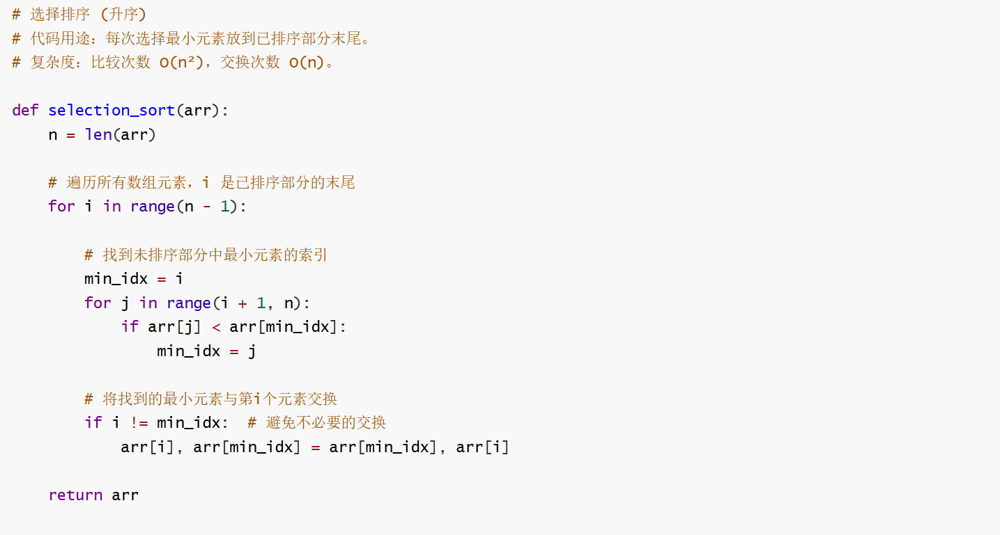
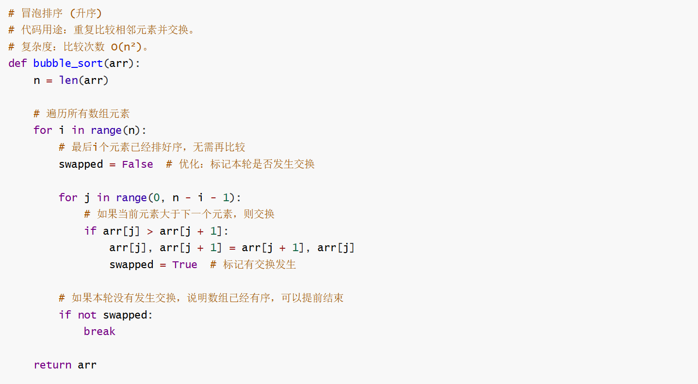
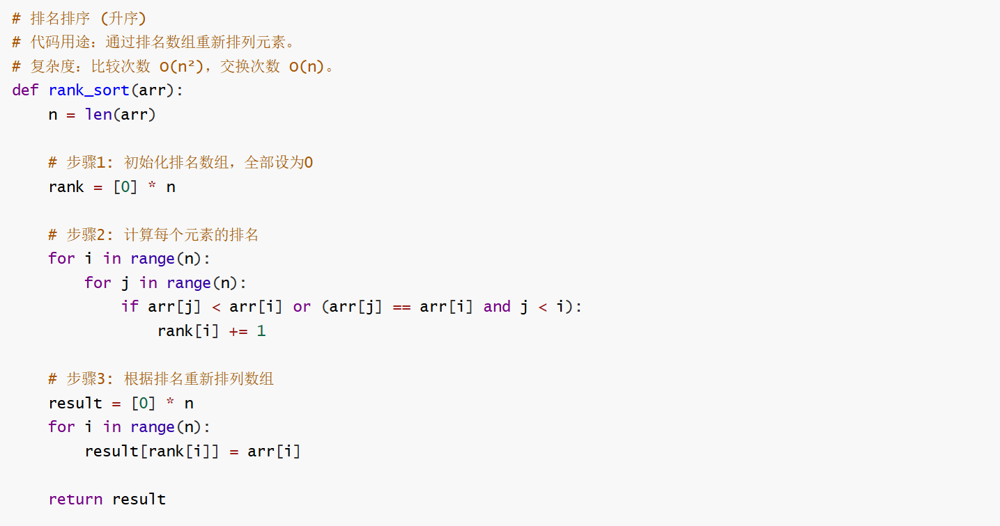
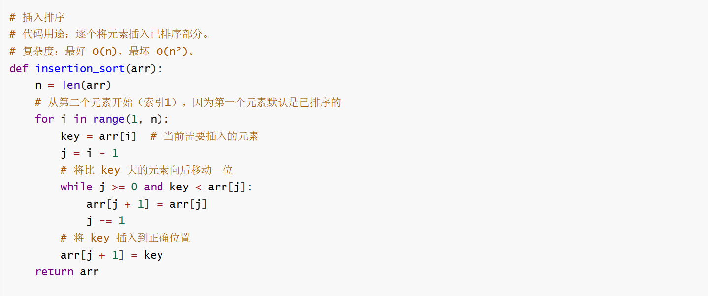
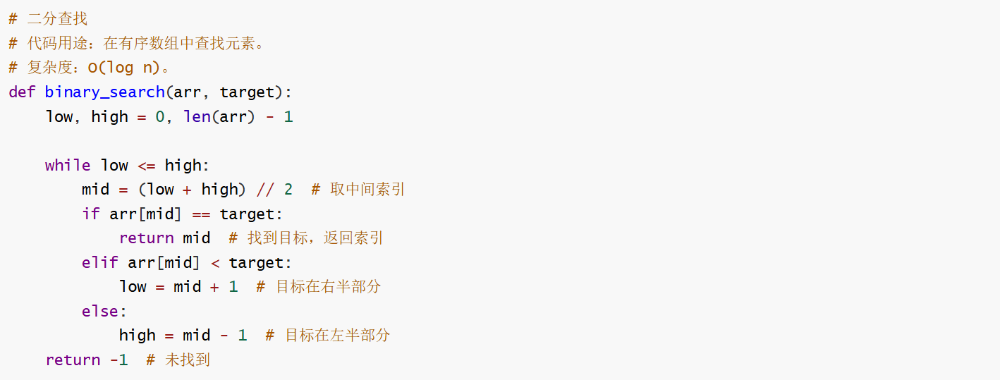
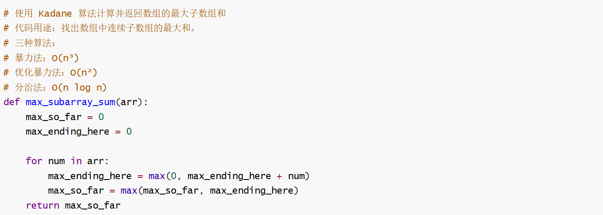
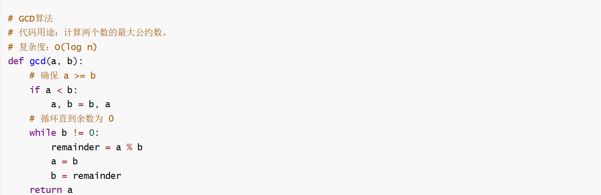
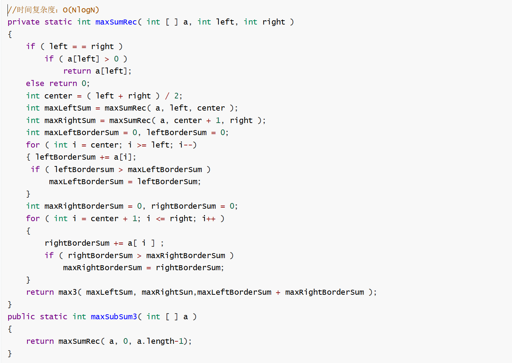

## 空间复杂度

###  组成部分：

- **指令空间**：存储程序指令。

- **数据空间**：存储常量、简单变量、复合变量。

- **环境栈空间**：保存部分完成函数恢复执行所需的信息。

  > 当一个函数（或方法、过程）被调用时，系统会为其在环境栈顶**压入（Push）一个“栈帧（Stack Frame）”** 或 **“活动记录（Activation Record）”**。这个栈帧就包含了恢复现场所需的所有信息，主要包括：
  >
  > 1. **返回地址（Return Address）**
  >    - 这是**最重要**的信息之一。它指明了当前函数执行完毕后，程序应该回到调用语句的**下一条指令**的地址继续执行。
  >    - 没有这个地址，程序就不知道接下来该干什么。
  > 2. **参数（Parameters）**
  >    - 存储调用该函数时传递进来的**实际参数的值或引用**。
  >    - 这样函数内部才能使用这些传入的值进行计算。
  > 3. **局部变量（Local Variables）**
  >    - 存储函数内部声明的**非静态局部变量**。
  >    - 这些变量在函数执行时存在，函数结束后其空间就被回收。
  > 4. **函数的返回值（Return Value）**
  >    - 为函数的返回值预留的存储空间。当函数执行到 `return` 语句时，返回值会被放入这个位置，以便调用者可以获取它。
  > 5. **上一个栈帧的指针（Pointer to the previous frame）**
  >    - 也称为**动态链（Dynamic Link）** 或 **调用者帧指针（Caller's Frame Pointer）**。
  >    - 它指向调用者函数（即当前函数的父函数）的栈帧的地址。这确保了在当前函数执行完毕后，系统知道如何“回溯”到之前的执行环境。
  > 6. **其他临时数据**
  >    - 存储函数执行过程中产生的**临时表达式结果**等，用于辅助计算。

### 为什么计算空间复杂度时不算指令所占的空间？

1. 指令部分所占的内存是固定的
2. 在很多系统中，这段空间是可以优化的
3. 指令所占的内存空间和数据不是一个数量级

## 时间复杂度

$$
T(p) = \text{compile time} + \text{run time}
$$

> [!NOTE]
>
> 对于欧几里得算法来说，最坏的情况是斐波那契数列！
>
> `0 1 1 2 3 5 8 11 ...`

### 1. 大O符号 (Big-O Notation) - 渐进上界

**定义：**
函数 `f(n) = O(g(n))` 当且仅当存在正常数 `c` 和 `n₀`，使得对于所有的 `n ≥ n₀`，都有：
`0 ≤ f(n) ≤ c ⋅ g(n)`

**解释：**

- **“f(n) = O(g(n))”** 的读法是“f(n) 是 g(n) 的大O”。
- 它意味着对于足够大的输入规模 `n`（即 `n > n₀`），函数 `f(n)` 的增长速度**至多**和 `g(n)` 一样快。
- `g(n)` 是 `f(n)` 的一个**渐进上界**。它描述的是算法运行时间的**最坏情况**。
- **关键点：** `f(n)` 可能比 `c⋅g(n)` 好得多，但绝不会更差。大O定义了一个“上限”，就像说“我最多身上有100块钱”，这并不排除你只有10块钱的可能性。

**例子：**

- `3n + 2 = O(n)` (取 `c = 4`, `n₀ = 2`)
- `2n² + 3n + 1 = O(n²)` (取 `c = 3`, `n₀ = 3`)
- `n² ≠ O(n)` // 不存在一个常数c使得对于所有足够大的n，n² ≤ c⋅n

---

### 2. 大Ω符号 (Big-Omega Notation) - 渐进下界

**定义：**
函数 `f(n) = Ω(g(n))` 当且仅当存在正常数 `c` 和 `n₀`，使得对于所有的 `n ≥ n₀`，都有：
`0 ≤ c ⋅ g(n) ≤ f(n)`

**解释：**

- 它意味着对于足够大的输入规模 `n`，函数 `f(n)` 的增长速度**至少**和 `g(n)` 一样快。
- `g(n)` 是 `f(n)` 的一个**渐进下界**。它描述的是算法运行时间的**最好情况**。
- **关键点：** `f(n)` 可能比 `c⋅g(n)` 差得多，但绝不会更好。大Ω定义了一个“下限”，就像说“我完成这项工作至少需要1小时”，这并不排除你需要10小时的可能性。

**例子：**

- `3n + 2 = Ω(n)` (取 `c = 3`, `n₀ = 1`)
- `2n² + 3n + 1 = Ω(n²)` (取 `c = 2`, `n₀ = 1`)
- `n ≠ Ω(n²)` // 不存在一个常数c使得对于所有足够大的n，c⋅n² ≤ n

---

### 3. 大Θ符号 (Big-Theta Notation) - 渐进紧确界

**定义：**
函数 `f(n) = Θ(g(n))` 当且仅当存在正常数 `c₁`, `c₂` 和 `n₀`，使得对于所有的 `n ≥ n₀`，都有：
`0 ≤ c₁ ⋅ g(n) ≤ f(n) ≤ c₂ ⋅ g(n)`

**解释：**

- 这是最强有力的描述。它意味着对于足够大的 `n`，函数 `f(n)` 的增长速度**恰好**与 `g(n)` 处于同一个数量级。
- `g(n)` 既是 `f(n)` 的渐进上界，也是其渐进下界。它**同时**用一个大O和一个大Ω限定了 `f(n)`。
- **关键点：** 它描述的是算法运行时间的**平均情况**或**严格确界**。当我们说“这个算法是Θ(n²)的”，我们的意思是它的最好和最坏情况（在常数因子内）都是n²级别的。

**例子：**

- `3n + 2 = Θ(n)` (取 `c₁ = 3`, `c₂ = 4`, `n₀ = 2`)
- `(1/2)n² - 3n = Θ(n²)` (取 `c₁ = 1/10`, `c₂ = 1/2`, `n₀ = 20`)
- `n ≠ Θ(n²)` 且 `n² ≠ Θ(n)` // 两者增长率不同，无法互相紧密约束

---

### 4. 小o符号 (Little-o Notation) - 非渐进紧确上界

**定义：**
函数 `f(n) = o(g(n))` 当且仅当对于**任意**正常数 `c > 0`，都存在一个 `n₀`，使得对于所有的 `n ≥ n₀`，都有：
`0 ≤ f(n) < c ⋅ g(n)`

**解释：**

- 小o关系比大O**更强、更严格**。
- 大O说“增长不快于”，而小o说“增长**严格慢于**”。
- **关键区别：** 大O定义中要求“存在一个常数c”，而小o要求“对于**任意**常数c（无论多小），这个不等式都成立”。这意味着函数 `f(n)` 相对于 `g(n)` 来说变得**微不足道**（insignificant）。

**例子：**

- `2n = o(n²)` // 线性增长严格慢于二次增长
- `n² ≠ o(n²)` // 这是大Θ关系，不是小o
- `n¹⋅⁹⁹ = o(n²)` // 虽然指数很接近，但仍然是严格更慢

---

### 总结与类比

为了帮助你更好地理解这些符号之间的区别，可以想象它们描述的是函数 `f(n)` 和 `g(n)` 在 `n→∞` 时的“竞赛”关系：

| 符号                 | 定义                        | 类比（f(n) 与 g(n) 的竞赛）                 | 描述                   |
| :------------------- | :-------------------------- | :------------------------------------------ | :--------------------- |
| **`f(n) = O(g(n))`** | `f(n) ≤ c⋅g(n)`             | `f(n)` **不会输掉**这场竞赛。               | 渐进上界（最坏情况）   |
| **`f(n) = Ω(g(n))`** | `f(n) ≥ c⋅g(n)`             | `f(n)` **不会赢**这场竞赛。                 | 渐进下界（最好情况）   |
| **`f(n) = Θ(g(n))`** | `c₁⋅g(n) ≤ f(n) ≤ c₂⋅g(n)`  | `f(n)` 和 `g(n)` **并列冲线**（速度相同）。 | 渐进紧确界（平均情况） |
| **`f(n) = o(g(n))`** | `f(n) < c⋅g(n)` (对于任意c) | `f(n)` **被 `g(n)` 远远甩开并输掉**了竞赛。 | 非紧确上界（严格更慢） |

在实际的算法分析中，**大O符号（O）** 是最常用的，因为它给出了性能的保证（最坏情况）。当我们说一个算法是 **O(n log n)** 时，我们是在向用户承诺：“无论输入多么糟糕，它的运行时间都不会比 n log n 增长得更快。”

## 分治法

把一个大问题分解成两个大致相等的子问题，然后递归地对它们求解

如何进一步优化到$$O(N)$$？---Kadane 算法！